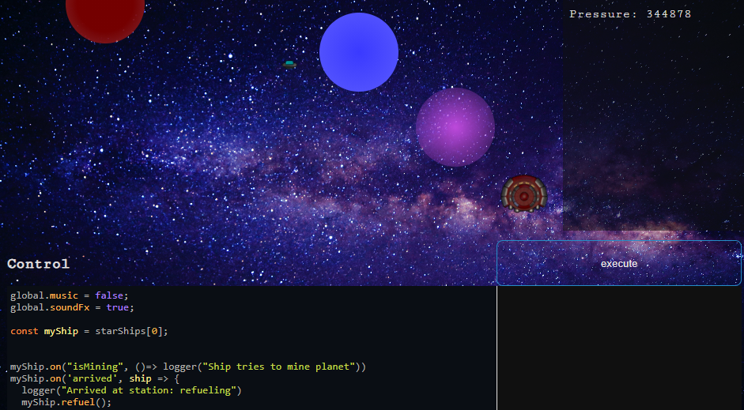

# ResourceMeJS

A JavaScript idle game for coders!

## Deployed @ [neoan.us/game](https://neoan.us/game/)

Like it? Leave me a star

### Welcome to the family business
Your wacky uncle has passed away, leaving you with his space station and mining business.
Being the character he was, he controlled the business using an ancient programming language called `JavaScript`.
Unfortunately, most of the code was lost in a sun-flare shortly before he passed away, along with his fleet.
He managed to construct one ship with the remaining resources. 

Can you write the code necessary to revitalize the operation and build an ever-growing fleet of mining ships?

## Credits:

**sound & music:** https://freesound.org/

## Yes, PRs are welcome!

